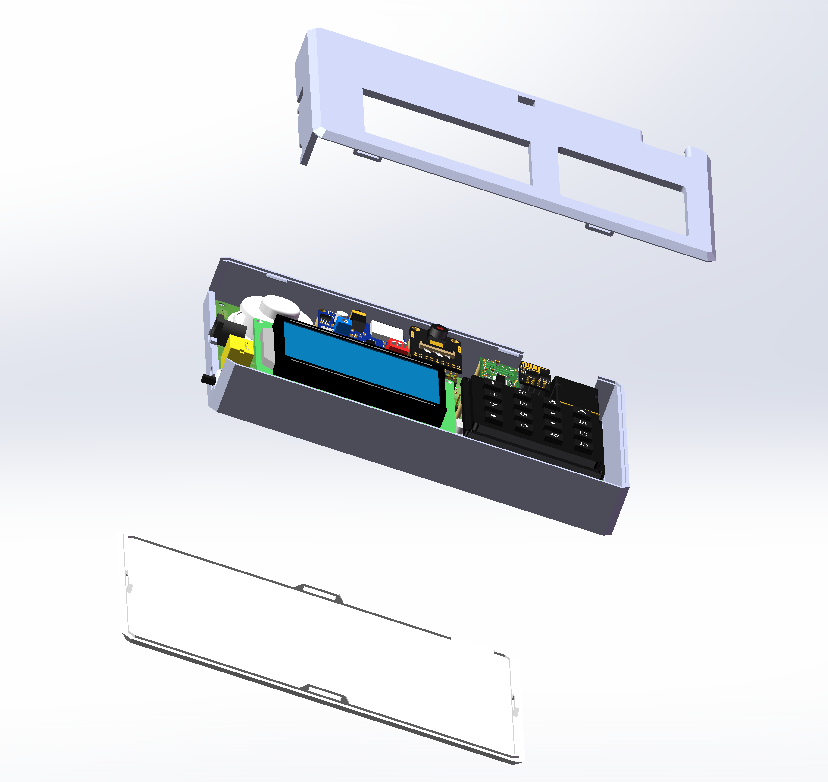
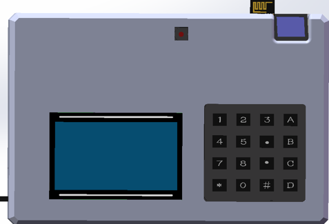
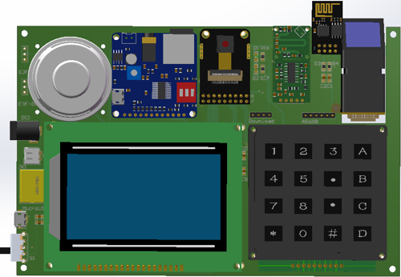
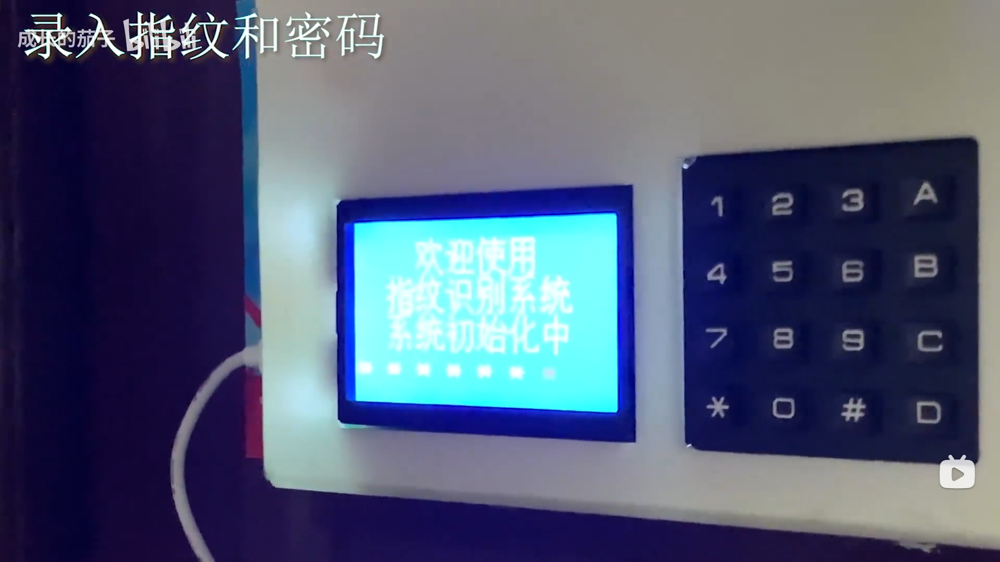
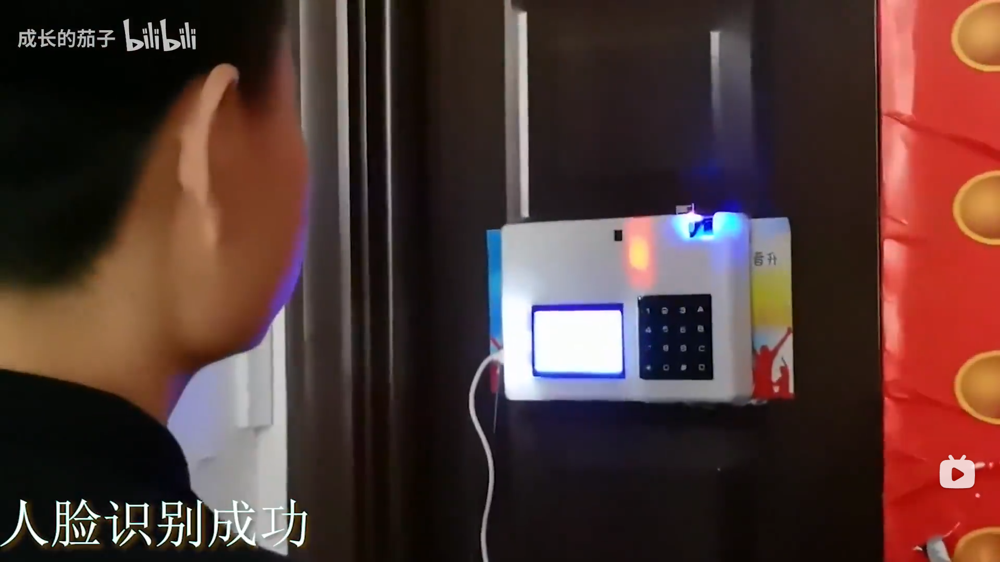

# Attendance Machine

**项目简介**：山东大学（威海）2020级数据科学与人工智能实验班单片机原理与实践+Python程序设计与linux基础综合项目：智能云考勤机，基于STC8A单片机，可实现本地指纹识别及云端人脸识别。

**项目周期**：2020年10月—2021年2月

**小组成员**：范传进、许家路、高梓又、王婧怡

**展示及讲解视频**：[智能云考勤机，大一新生的第一个工程项目](https://www.bilibili.com/video/BV16N41197cr/)

